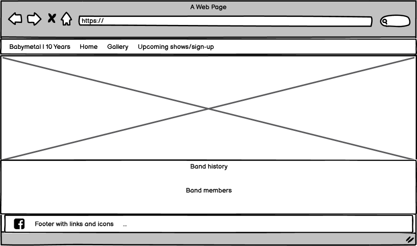
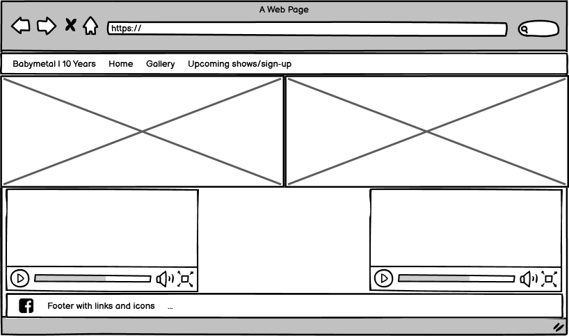
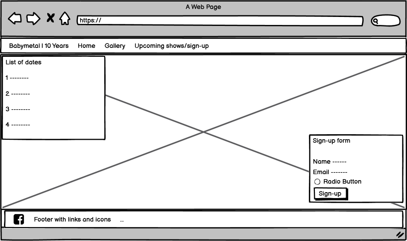

https://passion4film.github.io/Milestone-Project-1/

# BABYMETAL | 10 YEARS!
As this year marks the 10 year anniversary of the launch of one my favourite bands, and as they are so unique, I took this opportunity to create a website dedicated to them, to celebrate their 10 years with a brief history, band-member information, images and videos spanning their career to this point and a place where people could see when their upcoming shows were and sign-up for more information. 

## User stories

As a fan, I want to learn more about the band's history and members, so that I will understand where they come from and how they formed.

As a potential fan, I want to see examples of the band's music and see their pictures over the years, so I can see if I like their music and follow them.

As a fan/potenital fan, I want to see where they are performing next and sign-up for more information, so that I can go to see one of their shows live.

As a site owner, I want the band to sell more of their music and merchandise, so I will have links to these, so that the band can connect to more fans/potential fans and advertising their upcoming shows. Furthermore, as their audience is becoming more global, they wish to reach a wider international fan-base.

## Wireframes page designs:

## Features

Home-page: This page is the landing page when you visit the site, so it needed to be clear about what the website was about and contain information about the band and the band-members. There is a nav-bar and a footer which is the same accross all pages which allows the user to navigate the site easily.

Gallery: This page is where users can see an assortment of pictures of the band, from when they were very young until recently. It also contains a select few of their newest and most popular music videos, along with one video at the end that is made by combining all the pro-shots of the band for one of their songs - this one was chosen as it features the Kami band (the musicians) and allows users to see them after a breif explanation of them on the home-page.

Upcoming-shows/Sign-up: This page allows the user to see in a simple time-line format the upcoming shows for the band, including the locations and whether it's a festival or part of their own tour. Underneath this is a sign-up form, where the user can choose to submit to receive email updates about the band's performances and can choose their preference for UK only, Global or both, as the band is international and as the list of upcoming shows makes clear they tour all over the world. 

An additional feature that might be nice to be implemented in the future is a translation of the lyrics in the songs from the original Japanese, to the language of the user - first starting with English as the most widely spoken language of the international fan-base.

## Technologies Used

In this project I used HTML and CSS. I also made use of the Bootstrap frame-work library to assist in making the site mobile-responsive: https://getbootstrap.com/

GitHub,
Gitpod,
Responsinator, 
Balsamiq wireframes,
https://validator.w3.org/
https://jigsaw.w3.org/css-validator/,
Chrome browser & Microsoft Edge.

JQuery
The project uses JQuery to simplify DOM manipulation.

## Testing

I tested my website on people my own age, including someone who had been to one of Babymetal's live concerts and would test to see if the theme and layout matched the band's style. I also tested the website on people in their 60's and 70's, as it is important for a website to be user-friendly for all ages and internet abilities. All tests were successful and the users could navigate and enjoy the website for it's intended purpose.

I also tested my site's responsiveness using responsinator.com. I ran the code through the W3 HTML validator site and the Jigsaw CSS validator site. I also checked the site on other internet browsers, like Microsoft Edge to ensure it loaded correctly.

My project is nice and spaced out on desktop's and large screen resolutions, as the size decreases it adapts and text/images that can sit next to each other slot neatly ontop of each other and ensure that they can be read and seen at small screen sizes and on mobiles.

I did struggle to make my project mobile responsive at first, I received some advice from my Mentor and working with Bootstrap I was able to implement a grid system that improved my design for mobiles and small devices.

## Deployment

I deployed the project to a hosting platform using GitHub Pages.

## Credits

Content

The text for the band-history was taken from a few different sources and edited together; from Wikipedia: https://en.wikipedia.org/wiki/Babymetal, from Inverse https://www.inverse.com/article/12922-a-brief-history-of-japanese-metal-idol-band-babymetal & a fan-site https://babymetal.fandom.com/wiki/BABYMETAL

The band-member information was taken from the Wikipedia articles: https://en.wikipedia.org/wiki/Suzuka_Nakamoto & https://en.wikipedia.org/wiki/Moa_Kikuchi

Media

The photos used in this site were obtained from Google/images. There are alot of images used so an example of source sites are:  https://www.moshimoshi-nippon.jp/263692, https://www.kerrang.com/features/babymetal-communication-became-much-more-important-to-us-this-year/ & http://bmdb.sakura.ne.jp/bm/articles/site/48?page=61

The videos used in this site were obtained from www.youtube.com

## Acknowledgements

I received inspiration for this project from the mini-projects, especially the Love Running & Resume sites built as part of the course, my Mentor; Antonio Rodriguez and from Babymetal's officail site and youtube channel

**DISCLAIMER: This project is for educational purposes only, no materials/files are intended for any commercial use. In this document all sources will be credited.**
